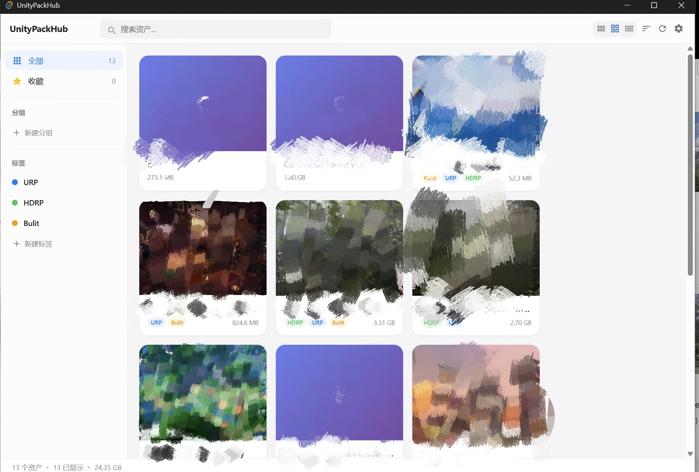
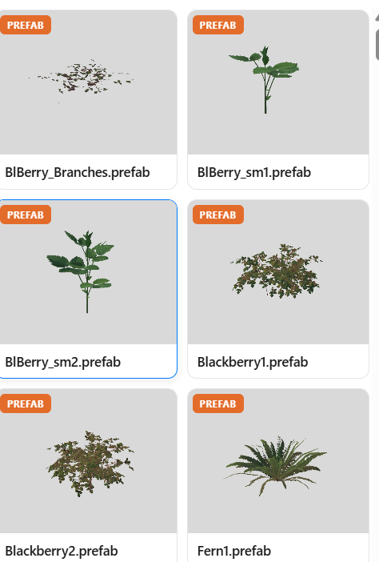
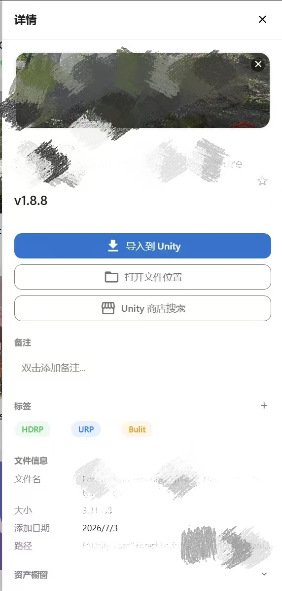

# UnityPackHub

Unity 离线资产管理工具 —— 不打开 Unity，直接浏览和管理你的 .unitypackage 资产包。

## 截图



<p align="center">
  
  &nbsp;&nbsp;
  
</p>

## 下载


项目里已经放好了打包好的安装程序，clone 下来直接装：

```
release/UnityPackHub_0.1.0_x64-setup.exe
```

双击运行，安装完打开即用。安装包只有 ~5MB。

> 也可以去 [Releases](../../releases) 页面下载最新版本。

## 功能一览

| 功能 | 说明 |
|------|------|
| 资产扫描 | 设置目录后自动发现所有 .unitypackage 文件 |
| 橱窗浏览 | 不用导入 Unity，直接查看包内 Prefab / 贴图 / 脚本列表 |
| 自动预览截图 | Unity 开着时自动渲染 Prefab 截图，下次打开就能看 |
| 标签系统 | 自定义标签 + 涂抹模式（点画笔，刷资产卡片批量打标签） |
| 分组 / 收藏 | 按项目分组，收藏常用资产置顶显示 |
| 搜索 | 按名称、文件名、备注、标签搜索 |
| 封面图 | 从文件拖入 / Ctrl+V 粘贴 / 点击选择，持久化存储 |
| 一键导入 Unity | 双击资产卡片直接导入 |
| Unity 商店搜索 | 一键跳转商店搜索该资产（自动去掉版本号后缀） |
| 素材网站快捷入口 | 内置 Unity Store / Fab / Sketchfab 等，可自定义 |
| 撤销 / 重做 | Ctrl+Z / Ctrl+Shift+Z |
| 中英文 / 亮暗主题 | 设置里切换 |

## 使用说明

### 首次使用

1. 打开 UnityPackHub
2. 点击右上角 **齿轮图标** 进入设置
3. 在「扫描目录」里添加你存放 .unitypackage 文件的文件夹
4. 关闭设置，工具会自动扫描并显示所有资产

### 打标签

- **单个**：点击资产卡片 → 详情面板 → 标签区域点 `+` → 选择标签
- **批量（涂抹模式）**：侧边栏标签旁边悬浮出现 🖌 画笔图标 → 点击激活 → 鼠标变十字 → 点击资产卡片刷标签 → `Esc` 退出

### 设置封面

打开资产详情面板后：

- **拖拽**：从文件管理器拖图片文件到应用窗口
- **粘贴**：网页 / 微信里复制图片，回到应用 `Ctrl+V`
- **选择**：点击封面区域，弹出文件选择框

### 自动预览截图

1. 打开 Unity 编辑器（任意项目）
2. 在 UnityPackHub 里点击「导入到 Unity」
3. 工具自动在 Unity 项目里部署桥接脚本
4. 脚本在后台自动渲染缺少预览的 Prefab
5. 下次打开橱窗，截图就有了

> 预览图存在 `%APPDATA%/com.unitypackhub.app/previews/`，不会污染你的 Unity 项目。

---

<details>
<summary><b>开发者：从源码构建</b></summary>

需要 [Node.js](https://nodejs.org/)（>= 18）和 [Rust](https://www.rust-lang.org/tools/install)（需要 VS C++ Build Tools）。

```bash
git clone https://github.com/nb-diok-in-sky/UnityPackHub.git
cd UnityPackHub
npm install
npx tauri build
```

构建产物在 `src-tauri/target/release/bundle/` 下。

开发模式：

```bash
npx tauri dev
```

</details>

<details>
<summary><b>技术栈 & 项目结构</b></summary>

**技术栈**

- 前端：Vue 3 + TypeScript + Quasar 2 + Pinia
- 桌面框架：Tauri 2（Rust + WebView2）
- 本地数据库：Dexie（IndexedDB）
- 包解析：Rust 端 tar + flate2

**项目结构**

```
src/
├── components/          # 界面组件
│   └── detail/          # 资产详情子组件
├── pages/               # 页面
├── stores/              # Pinia 状态管理
├── services/
│   ├── repositories/    # 数据持久化
│   ├── strategies/      # 排序策略
│   └── commands/        # 撤销重做
├── types/               # 类型定义
└── styles/              # 样式变量

src-tauri/src/
├── bridge/              # Unity C# 桥接脚本
├── package_parser.rs    # .unitypackage 解析
├── scanner.rs           # 文件扫描
└── unity_bridge.rs      # 预览截图桥接
```

</details>

## 许可证

[AGPL-3.0](LICENSE) — 免费使用和修改，衍生项目需同样开源。

## 反馈

有问题欢迎提 [Issue](../../issues)，觉得有用点个 Star 支持一下~
